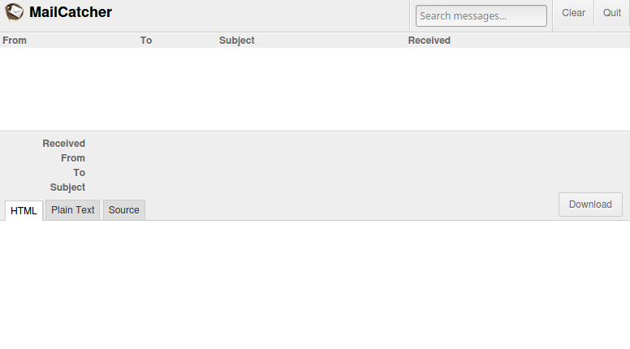

# The MailCatcher

This tool was forged by sj26 on https://github.com/sj26/mailcatcher. It is about catching and debugging e-mails send
from a dev environment. Written in Ruby, it also provides a small web interface, which we can use to put it all
together in a Docker container.

This image was forged to be used with the Docker-Proxy-Stack: https://github.com/Sengorius/docker-proxy-stack


## Usage

Try following on your shell with this container:

```shell script
docker run --name MailCatcher --rm \
    -p "1025:80" \  # mapping the internal port on port 1025 on you host system
    -p "587:25" \   # optional: change the smtp port from 25 (default) to something else
    sengorius/mail-catcher:latest
```

This runs the mailcatcher as a container until stopped with `ctrl-c`. Add the `-d` option to the command above, to
start the container in the background. Any e-mail send to `smtp://localhost:25` or `smtp://0.0.0.0:25` will be caught.
No username or password necessary.

As explained above, the ports can be changed when starting the container. This will have an effect on the catching
address: `smtp://localhost:587`.

Open up http://localhost:1025 in your browser to inspect all caught e-mails with the inbuild web client.


